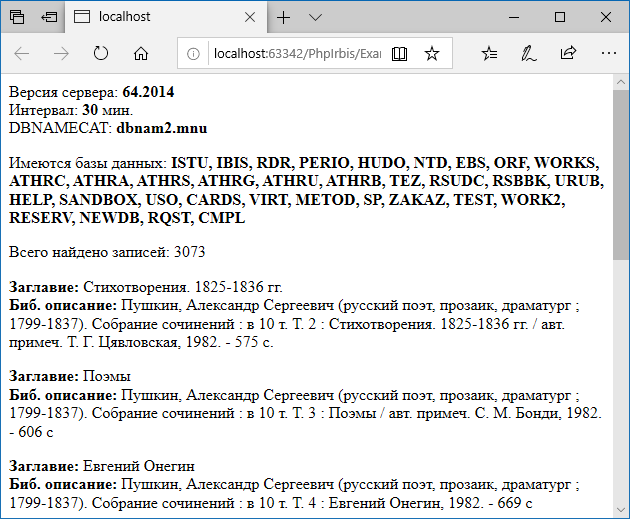

## Библиотека PhpIrbis

### Введение

`PhpIrbis` представляет собой простую библиотеку для создания клиентских приложений для системы автоматизации библиотек ИРБИС64 на языке PHP.

Пакет не содержит неуправляемого кода и не требует irbis64_client.dll. Успешно работает на 32-битных и 64-битных версиях операционных систем Windows и Linux.

Основные возможности пакета:

* Поиск и расформатирование записей.
* Создание и модификация записей, сохранение записей в базе данных на сервере.
* Работа с поисковым словарем: просмотр терминов и постингов.
* Администраторские функции: получение списка пользователей, его модификация, передача списка на сервер, создание и удаление баз данных.

Пакет состоит из одного файла `PhpIrbis.php` и зависит от двух расширений: `mbstring` и `sockets`, входящих в стандартную поставку PHP. В операционной системе Linux с PHP 7 может потребоваться установить пакет php-mbstring с помощью системного пакетного менеджера, например, так:

```
sudo apt-get install php-mbstring
```

Поддерживается PHP, начиная с версии 5.4 (как 32-битные, так и 64-битные версии интерпретатора) и сервер ИРБИС64, начиная с 2014. Более ранние версии PHP будут выдавать ошибки, т. к. пакет использует языковые возможности, появившиеся в PHP 5.4. Аналогично обстоит дело и с более ранними версиями сервера ИРБИС64.

**ВАЖНО** В `PhpIrbis` предполагается, что системная кодировка символов PHP -- UTF-8. В большинстве случаев это так, но если системная кодировка будет переопределена, то часть строк, участвующих в обмене с сервером, будет испорчена.

### Установка

PhpIrbis можно загрузить с GitHub: [https://github.com/amironov73/PhpIrbis](https://github.com/amironov73/PhpIrbis). Подключение `PhpIrbis` к своему проекту в этом случае тривиально: достаточно скачать с GitHub файл `PhpIrbis.php`, положить его рядом с другими файлами с исходным кодом и сослаться на него, например, в директиве `require` или `include`:

```php
require_once 'PhpIrbis.php';
```

Файл `PhpIrbis.php` содержит в себе весь необходимый код.

Однако предпочтительным способом является подключение библиотеки `PhpIrbis` с помощью Composer:



В файле `composer.json` достаточно добавить директиву `require`, ссылающуюся на пакет `amironov73/phpirbis`:

```json
{
  "name": "vendor_name/package_name",
  "description": "description_text",
  "require": {
    "amironov73/phpirbis": "dev-master"
  }
}
```

Composer создаёт в файле `vendor/autoload.php` автоматический загрузчик классов, которым можно воспользоваться так:

```php
// подключаем сгенерированный загрузчик
require __DIR__ . '/../vendor/autoload.php';

$connection = new Irbis\Connection();
$record = new Irbis\MarcRecord();
// и так далее
```

Классы и функции пакета `PhpIrbis` помещены в пространство имён `Irbis` (см. предыдущий пример кода).

### Примеры программ

Ниже прилагается пример простой программы. Сначала находятся и загружаются 10 первых библиографических записей, в которых автором является А. С. Пушкин. Показано нахождение значения поля с заданным тегом и подполя с заданным кодом. Также показано расформатирование записи в формат `brief`.

**ВАЖНО!** Обратите внимание, что `PhpIrbis` полагается на то, что исходные тексты программ записаны в системной кодировке UTF-8. Поэтому, если кодировка исходных текстов будет отличаться от ожидаемой, литералы будут искажены и программа может перестать работать.

Лучший вариант -- избегать употребления в тексте программы литералов с национальными символами. В наших примерах такие литералы употребляются исключительно для простоты изложения.

```php
require_once 'PhpIrbis.php';

try {

    // Подключаемся к серверу
    $connection = new Irbis\Connection();
    $connectString = 'host=127.0.0.1;user=librarian;password=secret;';
    $connection->parseConnectionString($connectString);

    if (!$connection->connect()) {
        echo "Не удалось подключиться!";
        echo Irbis\describe_error($connection->lastError);
        die(1);
    }

    // Общие сведения о сервере
    echo "<p>Версия сервера: <b>{$connection->serverVersion}</b><br/>";
    echo "Интервал: <b>{$connection->interval}</b> мин.<br/>";

    // Из INI-файла можно получить настройки для клиента
    $ini = $connection->iniFile;
    $dbnnamecat = $ini->getValue('Main', 'DBNNAMECAT');
    echo "DBNNAMECAT: <b>{$dbnnamecat}</b></p>\n";

    // Получаем список доступных баз данных
    $databases = $connection->listDatabases('1..' . $dbnnamecat);
    echo "<p>Имеются базы данных: <b>" . implode(', ', $databases) . "</b></p>\n";

    // Находим записи с автором "Пушкин"
    $found = $connection->search('"A=Пушкин$"');
    echo "<p>Всего найдено записей: " . count($found) . "</p>\n";

    if (count($found) > 10) {
        // Ограничиваемся первыми 10 записями
        $found = array_slice($found, 0, 10);
    }

    foreach ($found as $mfn) {
        // Считываем запись с сервера
        $record = $connection->readRecord($mfn);

        // Получаем значение поля/подполя
        $title = $record->fm(200, 'a');
        echo "<p><b>Заглавие:</b> {$title}<br/>";

        // Расформатируем запись на севере
        $description = $connection->formatRecord('@brief', $mfn);
        echo "<b>Биб. описание:</b> {$description}</p>\n";
    }

    // Отключаемся от сервера
    $connection->disconnect();
}
catch (Exception $exception) {
    echo "ОШИБКА: " . $exception;
}
```

Вышеприведённая программа сгенерирует примерно такую веб-страницу:



В следующей программе создается и отправляется на сервер 10 записей. Показано добавление в запись полей с подполями.

```php
require_once 'PhpIrbis.php';

try {

    // Подключаемся к серверу
    $connection = new Irbis\Connection();
    $connectString = 'host=127.0.0.1;user=librarian;password=secret;';
    $connection->parseConnectionString($connectString);

    if (!$connection->connect()) {
        echo "Не удалось подключиться!";
        echo Irbis\describe_error($connection->lastError);
        die(1);
    }

    // Записи будут помещаться в базу SANDBOX
    $connection->database = 'SANDBOX';

    for ($i = 0; $i < 10; $i++) {
        // Создаем запись
        $record = new Irbis\MarcRecord();

        // Наполняем ее полями: первый автор (поле с подолями),
        $record->add(700)
            ->add('a', 'Миронов')
            ->add('b', 'А. В.')
            ->add('g', 'Алексей Владимирович');

        // заглавие (поле с подполями),
        $record->add(200)
            ->add('a', "Работа ИРБИС64: версия {$i}.0")
            ->add('e', 'руководство пользователя');

        // выходные данные (поле с подполями),
        $record->add(210)
            ->add('a', 'Иркутск')
            ->add('c', 'ИРНИТУ')
            ->add('d', '2018');

        // рабочий лист (поле без подполей).
        $record->add(920, 'PAZK');

        // Отсылаем запись на сервер.
        // Обратно приходит запись,
        // обработанная AUTOIN.GBL.
        $connection->writeRecord($record);

        // Распечатываем обработанную запись
        echo '<p>' . $record->encode('<br/>') . '</p>';
    }

    // Отключаемся от сервера
    $connection->disconnect();
}
catch (Exception $exception) {
    echo "ОШИБКА: " . $exception;
}
```

[Следующая глава](chapter2.md)



